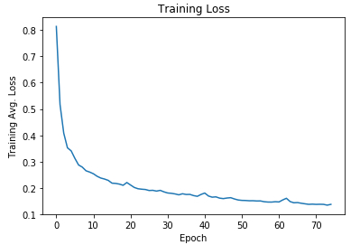
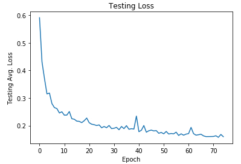

# Semantic-Segmentation-CarND
Semantic segmentation project for UDACITY's Self Driving Car Nanodegree
---


### Introduction
This is the project for the _Advanced Deep Learning_ elective of the UDACITY's Self Driving Car Nanodegree. The goal was to train and implement a deep fully convolutional neural network capable of performing semantic segmentation on road images. As shown in the video above, the network learns to classify pixels belonging to the road.

### Setup

##### Requirements
Make sure you have the following is installed:
 - [Python 3](https://www.python.org/)
 - [TensorFlow](https://www.tensorflow.org/)
 - [NumPy](http://www.numpy.org/)
 - [SciPy](https://www.scipy.org/)

##### Dataset
Download the [Kitti Road dataset](http://www.cvlibs.net/datasets/kitti/eval_road.php) from [here](http://www.cvlibs.net/download.php?file=data_road.zip).  Extract the dataset in the `data` folder.  This will create the folder `data_road` with all the training and test images.

- The link for the `VGG16` model is hardcoded into `helper.py`.  The model can be found [here](https://s3-us-west-1.amazonaws.com/udacity-selfdrivingcar/vgg.zip).

### Architecture

The model is based on the Fully Convolutional Network (FCN-8) proposed in [this](https://people.eecs.berkeley.edu/%7Ejonlong/long_shelhamer_fcn.pdf) paper. To speed up training we use a pretrained version of _VGG16_ as the network encoder.

The decoder is implemented as described in the paper above by making use of transposed convolutions to upsample the feature maps to the original image size. The output of the network classifies each pixel into two possible classes: road or background.

L2 regularization was applied on the decoder weights to improve the network performance and decrease overfitting.

### Data Augmentation

Given that the number of training images is small it is important to implement some data augmentation techniques to avoid overfitting and improve performance. Data augmentation takes place on the function _gen_batch_function()_ in lines 99-107 of _helpers.py_.

The code applies random contrast and brightness to the images and it also randomly flips the images horizontally when generating a training batch.

### Training the Model

To train the network just make sure of downloading the training datasets and the pretrained _VGG16_ model. Once this is done, execute the following command:

```
python main.py
```

I implemented the function _gen_test_batch()_ (lines 119-142 of _helpers.py_) to split the training data into training and validation sets. Having a validation set which is not used for training allowed me to better control the training process and to identify overfitting.

The code also stores the average training/validation loss per epoch as a pickle file. _main.ipynb_ can be used to load this data and to generate the training curves below.

<p align="center">
  
</p>

As it can be seen in the figures above, the loss of the model decreases over time with no evidence of overfitting to the training data. Training was stopped after epoch 75 because the model seems to converge and no significant improvement can be seen beyond that point.
